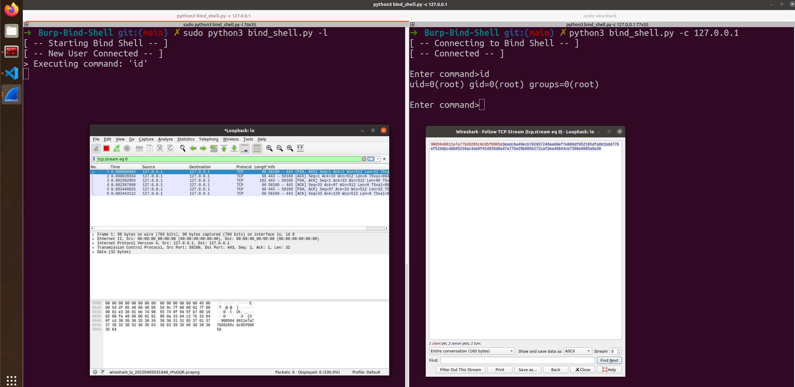

# Burp Bind Shell

A Burp extension that implements an encrypted bind shell.

## Dependency

Install PyCryptodome:

```shell
pip3 install pycryptodome
```

## Jython

Jython is an implementation of the Python programming language designed to run on the Java platform. Download Jython:

```shell
https://repo1.maven.org/maven2/org/python/jython-standalone/2.7.2/jython-standalone-2.7.2.jar
```

In Burp, go to "Extender -> Options -> Python Environment -> Select file" and select the `.jar` file you just downloaded.

## Usage

In a terminal, start the listener:

```shell
sudo python3 bind_shell.py -l
```

In another terminal, connect to the listener:

```shell
python3 bind_shell.py -c 127.0.0.1
```

## Feature

This bind shell is **encrypted** using AES. If the bind shell is unencrypted, the commands sent over the network can be easily intercepted using a sniffer tool such as Wireshark. For example, when executing the command `id`, Wireshark can only intercept the encrypted data:


