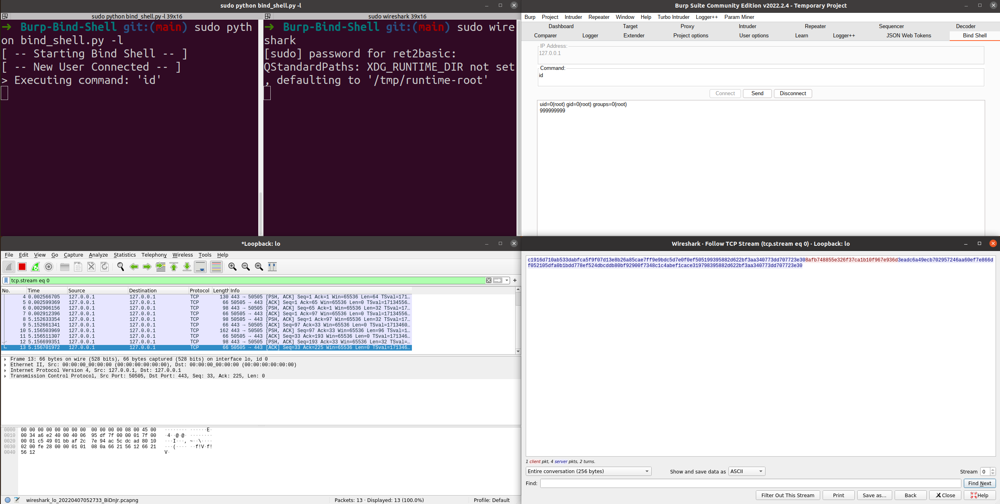
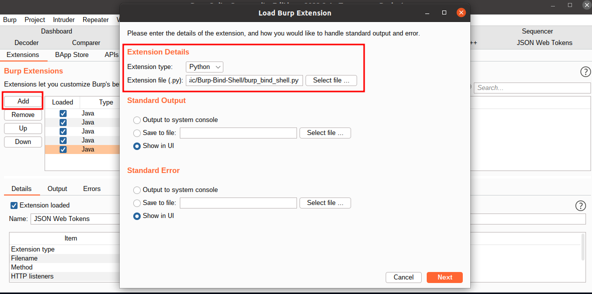

# Burp Bind Shell

## Feature

"Burp Bind Shell" is a Burp extension that implements an **encrypted** bind shell. It is written in **Python2** and the underlying encryption scheme is AES-CBC. The AES was implemented from scratch with zero dependency.

If the bind shell is unencrypted, the commands sent over the network can be easily intercepted using a sniffer tool such as Wireshark. With Burp Bind Shell, that won't be an issue. For example, when executing the command `id`, Wireshark can only intercept the encrypted data:



## Structure

This project is made of three major programs:

- `bind_shell.py`
  - An encrypted bind shell implementation that works in Linux/Windows command line.
- `burp_bind_shell.py`
  - A Burp extension that adds GUI to `bind_shell.py`.
- `aes.py`
  - An implementation of AES-CBC encryption/decryption with absolutely zero dependency.

## Dependencies

### PyCryptodome

Install PyCryptodome:

```shell
pip3 install pycryptodome
```

This is only needed if you wish to run the bind shell from terminal. If you just need the Burp extension, skip this part.

### Jython

Jython is an implementation of the Python programming language designed to run on the Java platform. Download the "standalone" version of Jython:

```shell
wget https://repo1.maven.org/maven2/org/python/jython-standalone/2.7.2/jython-standalone-2.7.2.jar
```

In Burp, go to "Extender -> Options -> Python Environment -> Select file" and select the `jython-standalone-2.7.2.jar` you just downloaded.

The sad thing is PyCryptodome has C code that Jython is not able to translate. For the Burp extension, I had to implement AES on my own.

## Usage

Open Burp, go to "Extender -> Extensions -> Add", choose "Extension type: Python" and select `burp_bind_shell.py`, then click "Next":



In a terminal, start the listener:

```shell
sudo python bind_shell.py -l
```

Note that the `python` here is Python2. In Burp, select the "Bind Shell" tab and enter an IP address. For local testing, the IP address is 127.0.0.1. Click "Connect". Once connected, enter a command and click "Send". When you finish all the work, click "Disconnect".
